# Author: Panagiotis Fiskilis/Neuro #

## Challenge name: GrrCON2015:Forensics ##

### Description: ###

```
There are 3 memory images: target1, target2, pos01 and ex01. The passwords to the zip files are mentioned in the question boxes
```

## Questions and Flags: ##

- Flag 1 :<code>th3wh1t3r0s3@gmail.com</code>

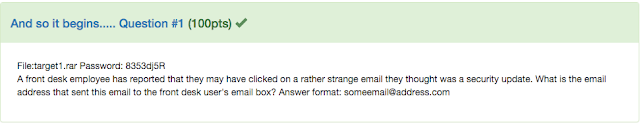

```bash
volatility -f Target1-1dd8701f.vmss imageinfo |tee imageinfo.log
volatility -f Target1-1dd8701f.vmss --profile=Win7SP1x86_23418 pslist |tee pslist.log
volatility -f Target1-1dd8701f.vmss --profile=Win7SP1x86_23418 pstree |tee pstree.log
mkdir dump
cat pslist.log |grep -i "exe" |grep -i "outlook" #We get the pid of the outlook.exe process:3196
volatility -f Target1-1dd8701f.vmss --profile=Win7SP1x86_23418 memdump -p 3196 -D dump
strings dump/3196.dmp |grep "@" |grep -e ".com" #We found a @allsafecybersec.com domain
strings dump/3196.dmp  |grep -A 10 -B 10 "To: <frontdesk@allsafecybersec.com>"
strings dump/3196.dmp |grep "From:" |head -1|cut -d " " -f 4
```

As always we have a Windows 7 machine:

<b>NOTE: Win7SP1x86_23418</b>

We found the frontdesk email address and then used grep for the email standard header format

- Flag 2 :<code>AnyConnectInstaller.exe</code>

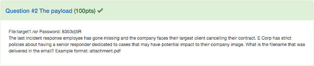

After some trial and error I used a test email as a header example and greped for content in order to see if I could find the attachment or at least the name:

```bash
strings dump/3196.dmp  |grep  "content" |head
```

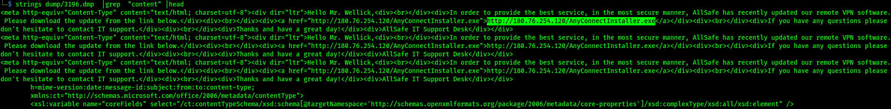

<b>NOTE: During the CTF the organizers told that the format *.pdf was wrong</b>

- Flag 3 :<code>MrRobot</code>

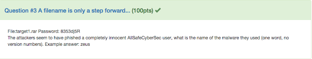

```bash
volatility -f Target1-1dd8701f.vmss --profile=Win7SP1x86_23418 filescan |tee filescan.log
cat filescan.log |grep "AnyConnectInstaller.exe"
volatility -f Target1-1dd8701f.vmss --profile=Win7SP1x86_23418 dumpfiles -Q 0x000000003e0bc5e0 -D dump
md5sum dump/file.None.0x858aef78.dat #23a9329505c6eb16840901524ca7bdc9
```

We have to find if the malware is cached and still on the computer so we will search inside the files:

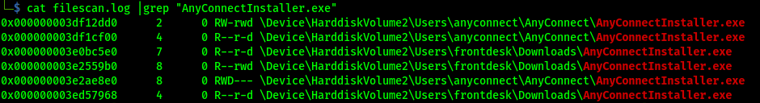

We use <code>VirusTotal</code> for some automated and dynamic analysis:

```
https://www.virustotal.com/gui/file/94a4ef65f99c594a8bfbfbc57f369ec2b6a5cf789f91be89976086aaa507cd47/behavior/Tencent%20HABO
```

Finally we check the registry and find the name.

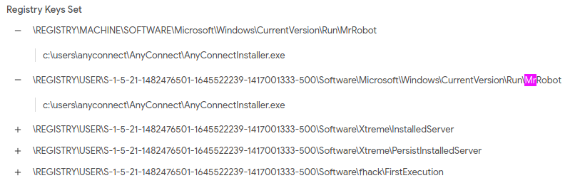

- Flag 4 :<code>2996</code>

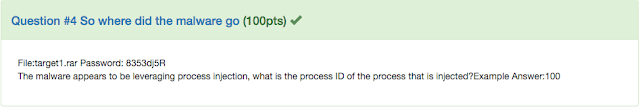

```bash
volatility -f Target1-1dd8701f.vmss --profile=Win7SP1x86_23418 cmdline |tee cmdline.log
volatility -f Target1-1dd8701f.vmss --profile=Win7SP1x86_23418 cmdscan |tee cmdscan.log
volatility -f Target1-1dd8701f.vmss --profile=Win7SP1x86_23418 consoles |tee consoles.log
```

The malware migrated to <code>iexplore.exe Pid:2996</code> and then spawned a shell

- Flag 5 :<code>fsociety0.dat</code>

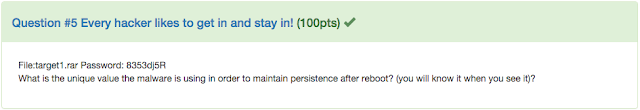

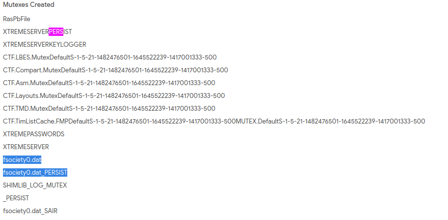

- Flag 6 :<code>GrrCon2015</code>

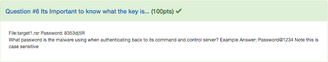

```bash
strings 2996.dmp |grep -A 20 -B 20 "gideon"
```

I used the dump from the malware and found that there is a user <code>gideon</code> with possibly higher privileges.

After some search and educated guessing I found the flag

- Flag 7 :<code>fsociety0.dat</code>

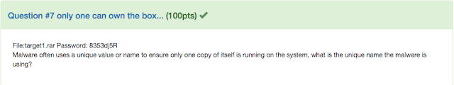

See the solution for Flag 5

- Flag 8 :<code>Hackers</code>

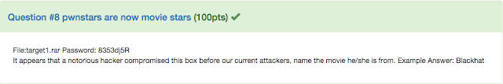

```bash
volatility -f Target1-1dd8701f.vmss --profile=Win7SP1x86_23418 cachedump
```

The precious attacker has possibly added a new user so I previously looked at the Windows registry and the Users for some weird user names but found nothing so I used <code>cachedump</code> in case the user was deleted and his creds where chached.

The attacker was <code>zerocool</code> and got the flag

- Flag 9 :<code>Administrator:500:aad3b435b51404eeaad3b435b51404ee:79402b7671c317877b8b954b3311fa82:::</code>

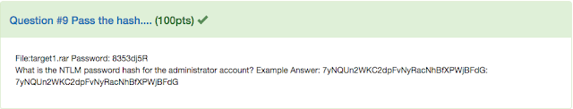

```bash
volatility -f Target1-1dd8701f.vmss --profile=Win7SP1x86_23418 hashdump |tee hashdump.log
```

We used <code>hashdump</code> to get the password hashes for the users, the Admin is one of them

- Flag 10 :<code>nbtscan.exe,Rar.exe,wce.exe</code>

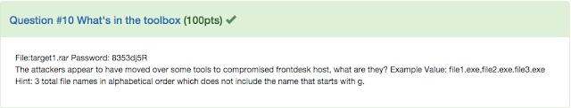

```bash
cat filescan.log |grep "exe" |grep "Temp"| rev |cut -d "\\" -f 1 |rev |sort|grep -v -i "^g" #We get all the tools inside Temp directory and exclude the one that starts with g as prompted
```

The <code>Rar.exe</code> was kinda sus so I to dump the file <sub>(but it was not cached)</sub> so I did some research and found out that it was actually a malware

- Flag 11 :<code>flagadmin@1234</code>

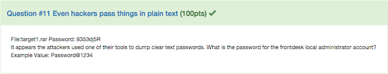

```bash
volatility --plugins=/opt/volatility/volatility/plugins/ -f Target1-1dd8701f.vmss --profile=Win7SP1x86_23418 mimikatz |tee mimikatz.log
```

I used the <code>consoles.log</code> file from the consoles plugin in volatility.

The shell that spawned from the process injection activated the <code>conhost.exe</code> app that called the server

```bash
cat consoles.log |grep -A 100 "conhost.exe" |less
```

- Flag 12 :<code>2015-10-09 10:45:12</code>

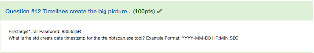

```bash
volatility  -f Target1-1dd8701f.vmss --profile=Win7SP1x86_23418 timeliner |tee timeliner.log
cat timeliner.log |grep "nbtscan"
```

- Flag 13 :<code>10.1.1.2</code>

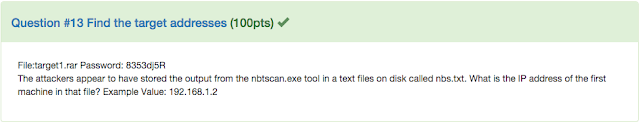

```bash
cat filescan.log |grep "Temp" |grep "nbs.txt"
volatility  -f Target1-1dd8701f.vmss --profile=Win7SP1x86_23418 dumpfiles -Q 0x000000003fdb7808 -D dump
cat file.None.0x83eda598.dat |head -1
```

- Flag 14 :<code>180.76.254.120:22</code>

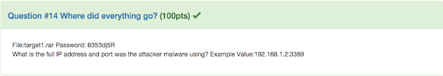

The report from VirusTotal mentioned the ipv4: <code>180.76.254.120</code>

So I searched for this foreign ip inside <code>netscan.log</code> and I combined the fact that we know both the IP and the process name(iexplore)

- Flag 15 :<code>Teamviewer.exe</code>

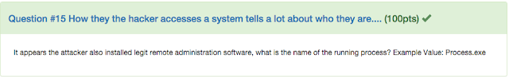

This flag is all over the place

- Flag 16 :<code>10.1.1.21</code>

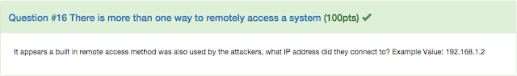

Again I used the netscan plugin and found the <code>mstsc.exe</code> which is a builtin windows RDP utility


- Flag 17 :<code>s9O3t%sd1q>:u5Za8Xrx_3Eg;(\qapu<"Rn$#QQJlsD m#;z2hbJkr*tLe>0)F[S)'USh3BKJILn3-?vt]q=s-Cp.ws9wVik[]5?#F\*l/J19+`PYco:au;T</code>

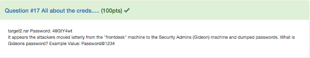

```bash
volatility -f target2-6186fe9f.vmss imageinfo |tee imageinfo.log #Find the user profile
volatility --plugin=/opt/volatility/volatility/plugins/ -f target2-6186fe9f.vmss --profile=Win7SP1x86_23418 mimikatz |tee mimikatz.log
volatility -f target2-6186fe9f.vmss --profile=Win7SP1x86_23418 lsadump |tee lsadump.log
volatility -f target2-6186fe9f.vmss --profile=Win7SP1x86_23418 filescan |tee filescan.log
volatility -f target2-6186fe9f.vmss --profile=Win7SP1x86_23418 pstree |tee pstree.log
volatility -f target2-6186fe9f.vmss --profile=Win7SP1x86_23418 hashdump |tee hashdump.log
cat filescan.log |grep -i "Tmp\|Temp"
mkdir dump
volatility -f target2-6186fe9f.vmss --profile=Win7SP1x86_23418 dumpfiles -Q 0x000000003fcf2798 -D dump
```

Again we have Windows 7

<b>NOTE:</b> <code>Win7SP1x86_23418</code>

The Description mentioned something about dumping passwords so the tool that the attacker used was probably <code>mimikatz OR lsadump OR a variation of those</code>


Finally I found this weird file, dumped it and got the password

- Flag 18 :<code>123qwe!@#</code>

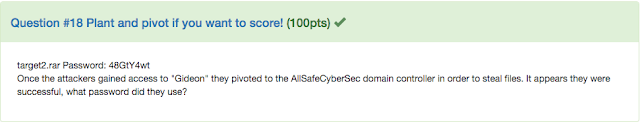

```bash
volatility -f target2-6186fe9f.vmss --profile=Win7SP1x86_23418 cmdline |tee cmdline.log
volatility -f target2-6186fe9f.vmss --profile=Win7SP1x86_23418 cmdscan |tee cmdscan.log
```

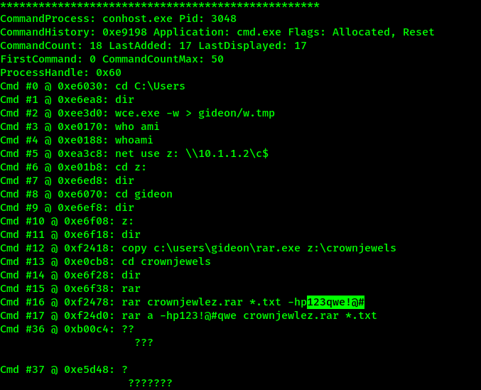

- Flag 19 :<code>crownjewlez.rar</code>

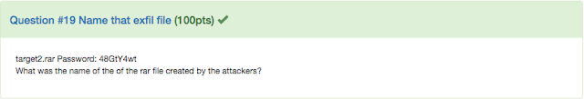


- Flag 20 :

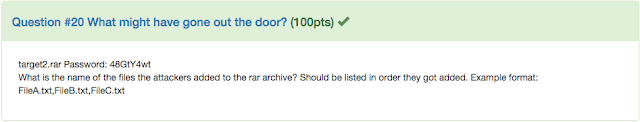

```bash
volatility -f target2-6186fe9f.vmss --profile=Win7SP1x86_23418 consoles |tee consoles.log
volatility -f target2-6186fe9f.vmss --profile=Win7SP1x86_23418 memdump -p 3048 -D dump/
volatility -f target2-6186fe9f.vmss --profile=Win7SP1x86_23418 procdump -p 3048 -D dump/
```

- Flag 21 :<code>1.bat</code>

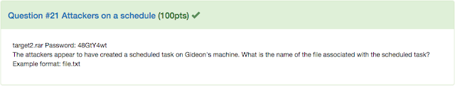

```bash
cat filescan.log |grep "job"
volatility -f target2-6186fe9f.vmss --profile=Win7SP1x86_23418 dumpfiles -Q 0x000000003fd05bd8 -D dump/
cat file.None.0x84135948.dat
```


- Flag 22 :<code>54.84.237.92</code>

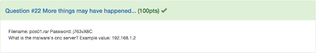

```bash
volatility -f POS-01-c4e8f786.vmss imageinfo |tee imageinfo.log
volatility -f POS-01-c4e8f786.vmss --profile=Win7SP1x86_23418 netscan |tee netscan.log
volatility -f POS-01-c4e8f786.vmss --profile=Win7SP1x86_23418 pstree |tee pstree.log
volatility -f POS-01-c4e8f786.vmss --profile=Win7SP1x86_23418 pslist |tee pslist.log
volatility -f POS-01-c4e8f786.vmss --profile=Win7SP1x86_23418 psxview |tee psxview.log
volatility -f POS-01-c4e8f786.vmss --profile=Win7SP1x86_23418 cmdline |tee cmdline.log
volatility -f POS-01-c4e8f786.vmss --profile=Win7SP1x86_23418 cmdscan | tee cmdscan.log
volatility -f POS-01-c4e8f786.vmss --profile=Win7SP1x86_23418 consoles |tee consoles.log
volatility -f POS-01-c4e8f786.vmss --profile=Win7SP1x86_23418 sockets |tee sockets.log
volatility -f POS-01-c4e8f786.vmss --profile=Win7SP1x86_23418 notepad |tee notepad.log
mkdir dump
volatility -f POS-01-c4e8f786.vmss --profile=Win7SP1x86_23418 memdump -p 2700 -D dump/ #Dump notepad's memory
volatility -f POS-01-c4e8f786.vmss --profile=Win7SP1x86_23418 filescan |tee filescan.log
volatility -f POS-01-c4e8f786.vmss --profile=Win7SP1x86_23418 malfind |tee malfind.log
```

As always Windows 7 for life

<b>NOTE: </b><code>Win7SP1x86_23418</code>

If we look at <code>pstree</code> we will see that explorer spawns a lot of child processes, that's sus


```bash
cat netscan.log |grep "explore"
```

- Flag 23 :<code>Dexter</code>

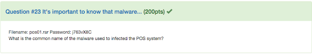

```bash
cat pstree |grep "explorer" #get pid
volatility -f POS-01-c4e8f786.vmss --profile=Win7SP1x86_23418 procdump -p 3208 -D dump
volatility -f POS-01-c4e8f786.vmss --profile=Win7SP1x86_23418 procdump -p 1836 -D dump
volatility --plugins=/opt/volatility/volatility/plugins/ -f POS-01-c4e8f786.vmss --profile=Win7SP1x86_23418 shimcachemem |tee shimcachemem.log
```

After about an hour of trial and error I started the true file eumeration and searched via the abduction method:

```bash
cat filescan.log |grep "exe$" |grep -v "Windows" |grep -v "explore" |grep -v "Program Files"
```

And found that the <code>kdcpr.exe</code> was actually not a legit application:


```bash
volatility -f POS-01-c4e8f786.vmss --profile=Win7SP1x86_23418 dumpfiles -Q 0x000000003e786960 -D dump
```

I used <code>VirusTotal</code> to find the malware's common name and got the flag:

```
https://www.virustotal.com/gui/file/074adbc4e4778ba575e6781323e60bd51dca545222aefe3acebde6e53b6c39a3/detection
```

- Flag 24 :<code>allsafe_protector.exe</code>

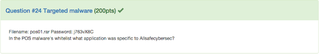

```bash
strings file.None.0x85a37988.dat |grep -i "all" |head -1
```

- Flag 25 :<code>allsafe_update.exe</code>

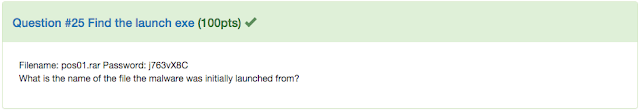

```bash
volatility -f POS-01-c4e8f786.vmss --profile=Win7SP1x86_23418 dumpfiles -Q 0x000000003e5f7e10 -D dump
```

- Flag 26 :<code>error1.aspx</code>

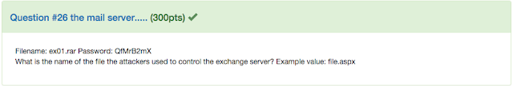


```bash
volatility -f Ex01-bb228ae5.vmss imageinfo |tee imageinfo.log
volatility -f Ex01-bb228ae5.vmss --profile=Win2012x64  filescan |tee filescan.log
volatility -f Ex01-bb228ae5.vmss --profile=Win2012x64 pstree |tee pstree.log
volatility -f Ex01-bb228ae5.vmss --profile=Win2012x64 cmdline |tee cmdline.log
volatility -f Ex01-bb228ae5.vmss --profile=Win2012x64 cmdscan |tee cmdscan.log
volatility -f Ex01-bb228ae5.vmss --profile=Win2012x64 netscan |tee netscan.log
volatility -f Ex01-bb228ae5.vmss --profile=Win2012x64 consoles |tee consoles.log
volatility -f Ex01-bb228ae5.vmss --profile=Win2012x64 psscan |tee psscan.log
mkdir dump
volatility -f Ex01-bb228ae5.vmss --profile=Win2012x64 memdump -p 5492 -D dump/
volatility -f Ex01-bb228ae5.vmss --profile=Win2012x64 mftparser |tee mftparser.log
volatility -f Ex01-bb228ae5.vmss --profile=Win2012x64 malfind |tee malfind.log
cat netscan.log |grep -v "127.0.0.1" |grep -v "::" |grep -v "0.0.0.0"
cat netscan.log |grep "180.76.254.120"
cat pstree.log |grep "w3wp"
strings Ex01-bb228ae5.vmss |grep "180.76.254.120"
foremost Ex01-bb228ae5.vmss
cat mftparser.log |grep "error1.aspx"
cat mftparser.log|grep -B 20 "error1.aspx"
strings Ex01-bb228ae5.vmss |grep "error1.aspx"
strings Ex01-bb228ae5.vmss |grep -A 20 "error1.aspx"
```

<b>NOTE:</b> <code>Win2012x64</code>

From the <code>netscan</code> plugin and a smart grep we get an external IPv4: <code>180.76.254.120</code>

From strings we find a file named <code>error1.aspx</code> which is really weird but I really wanted to see more about it so I used <code>foremost</code> 

Found nothing special with foremost but using the mftparser log I found that the location of the file was really peculiar and I was sure that this was the malicious file.

From the last strings command we find that the <code>error1.aspx</code> file got a lot of POST requests with parameters such as powershell, so we may have a RCE case here.

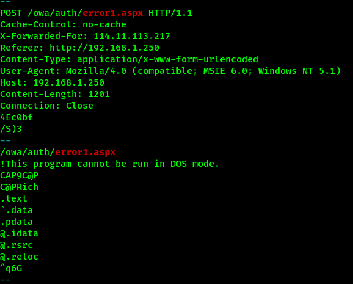

And I was correct from the previous screenshot we are sure that this file gave RCE

- Flag 27 :<code>chinachopper</code>

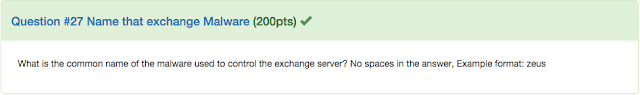

```bash
strings Ex01-bb228ae5.vmss|grep "POST"|grep -A 30 "/owa/auth/error1.aspx" 
strings Ex01-bb228ae5.vmss |grep "fs0ciety"
```

We MUST find the file and read the content

After about an hour of search I noded to the correct way which was the theme of the Challenge so the community told me to just grep for Mr Robot things

After a lot of decoding and the research on the original malware(from the official chinese website) I found this article:

```
https://www.mandiant.com/resources/breaking-down-the-china-chopper-web-shell-part-ii
```

- Flag 28 :<code> eNpzLypyzs/zyS9LLfYtCspPyi9xzEtxKzZIzkwtqVRUVAQAybULlw==</code>

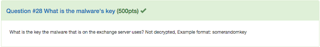

```bash
cat mftparser.log |grep "txt\|key\|k3y"
cat mftparser.log |grep "th3k3y.txt"
```

An article mentioned that the <code>chinachopper</code> malware always leaves a key behind as a text file so I searched properly

I managed to carve out the ey file and got the flag
