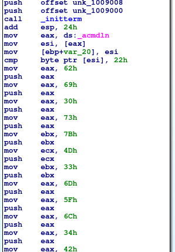

# Author: Panagiotis Fiskilis/Neuro

# Challenge name:MemLabs:Lab5/Black Tuesday

## Description: ##

```
We received this memory dump from our client recently. Someone accessed his system when he was not there and he found some rather strange files being accessed. Find those files and they might be useful. I quote his exact statement,

    The names were not readable. They were composed of alphabets and numbers but I wasn't able to make out what exactly it was.

Also, he noticed his most loved application that he always used crashed every time he ran it. Was it a virus?

Note-1: This challenge is composed of 3 flags. If you think 2nd flag is the end, it isn't!! :P

Note-2: There was a small mistake when making this challenge. If you find any string which has the string "L4B_3_D0n3!!" in it, please change it to "L4B_5_D0n3!!" and then proceed.

Note-3: You'll get the stage 2 flag only when you have the stage 1 flag.
```

Link for Challenge image:

```
https://mega.nz/file/Ps5ViIqZ#UQtKmUuKUcqqtt6elP_9OJtnAbpwwMD7lVKN1iWGoec
```

# Solution:

```bash
strings MemoryDump_Lab5.raw |grep -i "Linux"
strings MemoryDump_Lab5.raw |grep "Welcome"
volatility -f MemoryDump_Lab5.raw imageinfo
```
**Note:**

```--profile=Win7SP1x64```

Windows 7 patient again

```bash
volatility -f MemoryDump_Lab5.raw --profile=Win7SP1x64 pslist
volatility -f MemoryDump_Lab5.raw --profile=Win7SP1x64 pstree
volatility -f MemoryDump_Lab5.raw --profile=Win7SP1x64 cmdline
volatility -f MemoryDump_Lab5.raw --profile=Win7SP1x64 cmdscan
volatility -f MemoryDump_Lab5.raw --profile=Win7SP1x64 consoles
volatility -f MemoryDump_Lab5.raw --profile=Win7SP1x64 hashdump |tee hashdump.log
volatility --plugin=/opt/volatility/volatility/plugins -f MemoryDump_Lab5.raw --profile=Win7SP1x64 mimikatz |tee mimikatz.log
volatility -f MemoryDump_Lab5.raw --profile=Win7SP1x64 filescan |tee filescan.log
```
After the enum from the <code>cmdline</code> plugin I found a file that matches the description from the challenge description:

```
WinRAR.exe pid:   2924
Command line : "C:\Program Files\WinRAR\WinRAR.exe" "C:\Users\SmartNet\Documents\SW1wb3J0YW50.rar"
```

```bash
cat filescan.log |grep "SW1wb3J0YW50.rar"
0x000000003eed56f0      1      0 R--r-- \Device\HarddiskVolume2\Users\SmartNet\Documents\SW1wb3J0YW50.rar
mkdir dump
volatility -f MemoryDump_Lab5.raw --profile=Win7SP1x64 dumpfiles -Q 0x000000003eed56f0 -D dump
mv file.None.0xfffffa80010b44f0.dat file.None.0xfffffa80010b44f0.dat.rar
```

The rar file has a password and it is the flag from the first stage

**Note:**

The rar is the 2nd stage

**2nd flag**

Let's find this flag

After having a brief look at the <code>pstree</code> output I found a peculiar process named <code>SearchFilterHo</code> and after some google search I found out that this process was the program that the challenge description said that it was a virus so I dumped it's memory:

```bash
... 0xfffffa8000f63060:SearchFilterHo                2608   1800      5     78 2019-12-20 03:46:41 UTC+0000
volatility -f MemoryDump_Lab5.raw --profile=Win7SP1x64 memdump -p 2608 -D dump
cd dump
strings 2608.dmp |grep "Zmxh"
```

**1st Flag**

And got the flag from the stage 1

Now we can find the second flag

```bash
unrar e file.None.0xfffffa80010b44f0.dat.rar
password:flag{!!_w3LL_d0n3_St4g3-1_0f_L4B_5_D0n3_!!}
eog Stage2.png
```

**2nd Flag**

For the last flag I suspect that something is wrong with the all caps <code>NOTEPAD.EXE</code> process

So I dumped everything:

**Note:**

The <code>memdump</code> gave nothing so I went for <code>procdump</code> and Reverse engineering:

```bash
volatility -f MemoryDump_Lab5.raw --profile=Win7SP1x64 procdump -p 2724 -D dump
```

After some Reverse engineering with ida I found the flag in hex 



**3rd flag**

# Flags:

1. ```flag{!!_w3LL_d0n3_St4g3-1_0f_L4B_5_D0n3_!!}```

2. ```flag{W1th_th1s_$taGe_2_1s_c0mPL3T3_!!}```

3. ```bi0s{M3m_l4b5_OVeR_!}```
