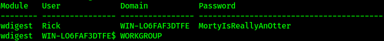

# Author: Panagiotis Fiskilis/Neuro #

## Challenge name: OtterCTF 2018:Forensics: Question 1 – What the password? ##

### Description: ###

```
You got a sample of Rick's PC's memory.Can you get the user password?
```

#### Solution: ####

First things first we have to find the user profile, we will use <code>Volatility</code> and log into a file the output:

```bash
volatility -f OtterCTF.vmem imageinfo |tee imageinfo.log
```

We have a Windows 7 machine:

<i>NOTE:</i> Win7SP1x64

Now let's try some low hanging fruits with Volatility to get the user password:

```bash
volatility -f OtterCTF.vmem --profile=Win7SP1x64 hashdump |tee hashdump.log
volatility -f OtterCTF.vmem --plugins=/opt/volatility/volatility/plugins/ --profile=Win7SP1x64 mimikatz |tee mimikatz.log
```

We can find Rick's real password using the <code>mimikatz</code> plugin to show us the password in plaintext and <u>not</u> in hash as shown in the <code>hashdump.log</code> file



<code>Flag: CTF{MortyIsReallyAnOtter}</code>
