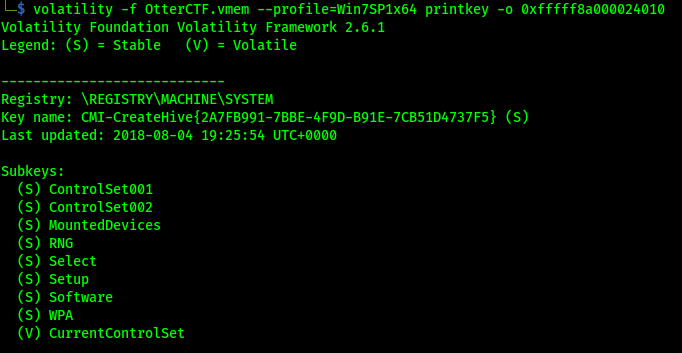
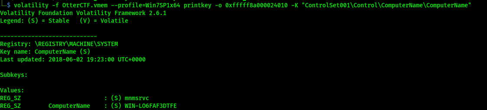
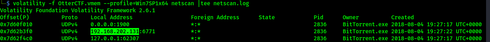

# Author: Panagiotis Fiskilis/Neuro #

## Challenge name: OtterCTF 2018:Forensics: Question 2 – General Info ##

### Description: ###

```
Let's start easy- What's the PC's name and IP address?
```

#### Solution: ####

We will use the user profile from previous challenge:

<i>NOTE:</i> Win7SP1x64

- We will use the registry to find the computer name with the <code>hivescan,hivelist,printkey</code> plugins
- The IP address can either be found by registry or with the netscan plugin

```bash
volatility -f OtterCTF.vmem --profile=Win7SP1x64 hivelist |tee hivelist.log
volatility -f OtterCTF.vmem --profile=Win7SP1x64 printkey -o 0xfffff8a000024010 -K ControlSet001
volatility -f OtterCTF.vmem --profile=Win7SP1x64 printkey -o 0xfffff8a000024010 -K "ControlSet001\Control"
volatility -f OtterCTF.vmem --profile=Win7SP1x64 printkey -o 0xfffff8a000024010 -K "ControlSet001\Control\ComputerName\ComputerName"
```





Now we will use netscan to search for our computer's IP:

```bash
volatility -f OtterCTF.vmem --profile=Win7SP1x64 netscan |tee netscan.log
```



# Flags: #

- <code>Flag1: CTF{WIN-LO6FAF3DTFE}</code>
- <code>Flag2: CTF{192.168.202.131}</code>
