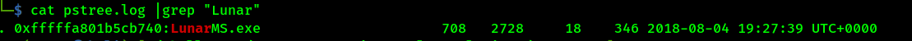
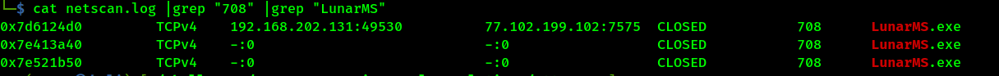

# Author: Panagiotis Fiskilis/Neuro #

## Challenge name: OtterCTF 2018:Forensics: Question 3 – Play Time ##

### Description: ###

```
Rick just loves some good old videogames. Can you tell which game is he playing? What is the server IP?
```

#### Solution: ####

<i>NOTE:</i> Win7SP1x64

Hopefully the game is still active, so we will use volatility and <code>pslist,pstree,psxview</code>

```bash
volatility -f OtterCTF.vmem --profile=Win7SP1x64 pslist |tee pslist.log
volatility -f OtterCTF.vmem --profile=Win7SP1x64 pstree |tee pstree.log
volatility -f OtterCTF.vmem --profile=Win7SP1x64 psxview |tee psxview.log
```


We use <code>grep</code> inside our <code>netscan</code> log from the previous Challenge:

```bash
cat pstree.log |grep "Lunar" # The pid is 708
cat netscan.log |grep "708" |grep "LunarMS"
```





# Flags: #

- <code>Flag1: CTF{LunarMS}</code>
- <code>Flag2: CTF{77.102.199.102}</code>
