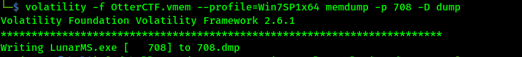

# Author: Panagiotis Fiskilis/Neuro #

## Challenge name: OtterCTF 2018:Forensics: Question 4 – Name Game ##

### Description: ###

```
We know that the account name was logged in to a channel called Lunar-3. What is the account name?
```

#### Solution: ####

<i>NOTE:</i> Win7SP1x64

```bash
mkdir dump
volatility -f OtterCTF.vmem --profile=Win7SP1x64 memdump -p 708 -D dump
```

We will use volatility with the <code>memdump</code> plugin in order to get some saved data from the game



```bash
strings 708.dmp |grep -A 1 "Lunar-3"
```


# Flag: #

<code>CTF{0tt3r8r33z3}</code>
