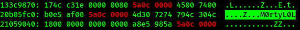

# Author: Panagiotis Fiskilis/Neuro #

## Challenge name: OtterCTF 2018:Forensics: Question 5 – Name Game 2 ##

### Description: ###

```
From a little research we found that the username of the logged on character is always after this signature: 0x64 0x??{6-8} 0x40 0x06 0x??{18} 0x5a 0x0c 0x00{2}. What is Rick's character's name?
```

#### Solution: ####

<i>NOTE:</i> Win7SP1x64

We will use the file from the previous challenge: <code>708.dmp</code>

Based on the description of the offset we will create a grep pattern: <code>5a0c 0000</code>

```bash
xxd 708.dmp |grep "5a0c 0000"
```



# Flag: #

<code>CTF{M0rtyL0L}</code>
