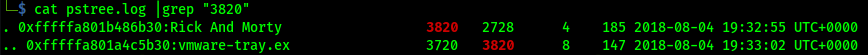

# Author: Panagiotis Fiskilis/Neuro #

## Challenge name: OtterCTF 2018:Forensics: Question 7 – Hide and Seek ##

### Description: ###

```
The reason we took Rick's PC memory dump is because there was a malware infection. Please find the malware process name(including the extension)
```

#### Solution: ####

<i>NOTE:</i> Win7SP1x64

As always we will use volatility and the process oriented plugins alongside the <code>malfind,cmdline,cmdscan,consoles</code> plugins

We will also use logs from previous challenges

```bash
volatility -f OtterCTF.vmem --profile=Win7SP1x64 malfind |tee malfind.log
volatility -f OtterCTF.vmem --profile=Win7SP1x64 psxview |tee psxview.log
volatility -f OtterCTF.vmem --profile=Win7SP1x64 cmdline |tee cmdline.log
volatility -f OtterCTF.vmem --profile=Win7SP1x64 cmdscan |tee cmdscan.log
volatility -f OtterCTF.vmem --profile=Win7SP1x64 consoles |tee consoles.log
```
From the <code>cmdline</code> plugin we can see that Rick downloaded via torrent a shady exe file:


Using the newly discovered PID we use pstree and get the flag:



# Flag: #

<code>CTF{vmware-tray.exe}</code>
