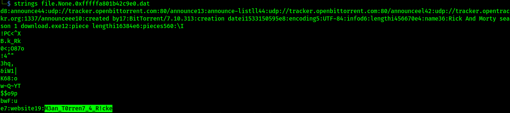

# Author: Panagiotis Fiskilis/Neuro #

## Challenge name: OtterCTF 2018:Forensics: Question 8 – Path to Glory ##

### Description: ###

```
How did the malware got to Rick's PC? It must be one of rick's old illegal habits... 
```

#### Solution: ####

<i>NOTE:</i> Win7SP1x64

As mentioned in the previous challenge the nefarious exe file came to the computer via torrent:

![])(./Images/legit.png)

Now we will use <code>filescan and dumpfiles</code> to get the .torrent file

```bash
volatility -f OtterCTF.vmem --profile=Win7SP1x64 filescan |tee filescan.log
cat filescan.log |grep "Morty"
mkdir dump
volatility -f OtterCTF.vmem --profile=Win7SP1x64 dumpfiles -Q 0x000000007d63dbc0 -D dump
volatility -f OtterCTF.vmem --profile=Win7SP1x64 dumpfiles -Q 0x000000007d8813c0 -D dump
volatility -f OtterCTF.vmem --profile=Win7SP1x64 dumpfiles -Q 0x000000007dae9350 -D dump
```
After some trial and error we use strings and get the flag:



# Flag: #

<code>CTF{M3an_T0rren7_4_R!cke}</code>
